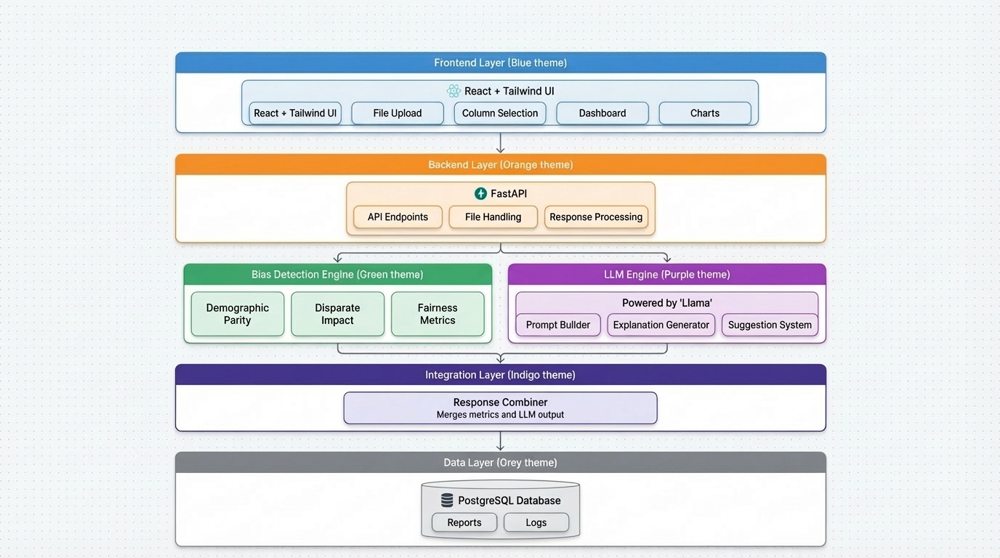

 

 ┌───────────────┐
 │   Frontend    │
 │ React UI      │
 └──────┬────────┘
        ↓
 ┌───────────────┐
 │   Backend     │
 │ FastAPI       │
 └──────┬────────┘
        ↓
 ┌───────────────┬───────────────┐
 │ Bias Engine   │   LLM Engine  │
 │ Metrics       │   llma3       │
 └──────┬────────┴───────┬───────┘
        ↓                ↓
     ┌─────────────────────────┐
     │   Response Combiner     │
     └──────────┬──────────────┘
                ↓
         ┌───────────────┐
         │   Database    │
         └───────────────┘

# 🚀 NorthStar AI  
### AI-Powered Fairness Detection & Explainability System

NorthStar AI is an intelligent system designed to detect, analyze, and explain bias in datasets and machine learning models. It combines statistical fairness metrics with LLM-powered insights to help developers build ethical and transparent AI systems.

---

## 📌 Features

- 📊 Detects bias using fairness metrics:
  - Demographic Parity
  - Disparate Impact
- 🤖 LLM-powered explanations using **LLaMA (via Grok)**
- 📈 Interactive dashboard with visual insights
- 🧠 Smart suggestions to mitigate bias
- 🔍 Model tracking using **MLflow**
- ⚡ Fast backend powered by **FastAPI**
- 🗄️ Scalable storage using **PostgreSQL**

---

## 🏗️ Architecture Diagram

<!-- Add your architecture diagram image below -->

---

## 🔄 Project Workflow

<!-- Add your workflow diagram image below -->

---

## 🧠 Tech Stack

### Frontend
- React.js
- Tailwind CSS

### Backend
- FastAPI (Python)

### AI & ML
- LLaMA (via Grok API)
- Scikit-learn
- Pandas

### Model Tracking
- MLflow

### Database
- PostgreSQL

---

## ⚙️ How It Works

1. User uploads dataset (CSV format)
2. Selects:
   - Sensitive attribute (e.g., gender)
   - Target variable (e.g., approval)
3. System computes fairness metrics:
   - Demographic Parity
   - Disparate Impact
4. Bias report is generated
5. LLM analyzes results and provides:
   - Explanation
   - Risk assessment
   - Actionable suggestions
6. Results are visualized on dashboard
7. Model performance is tracked using MLflow

---

## 📂 Project Structure
